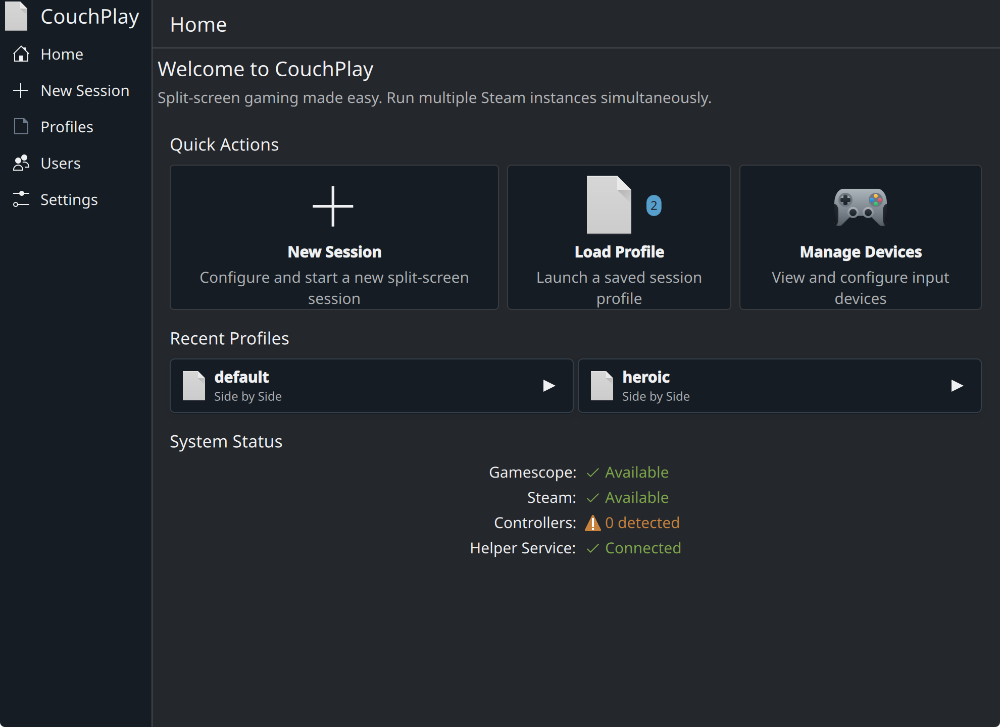
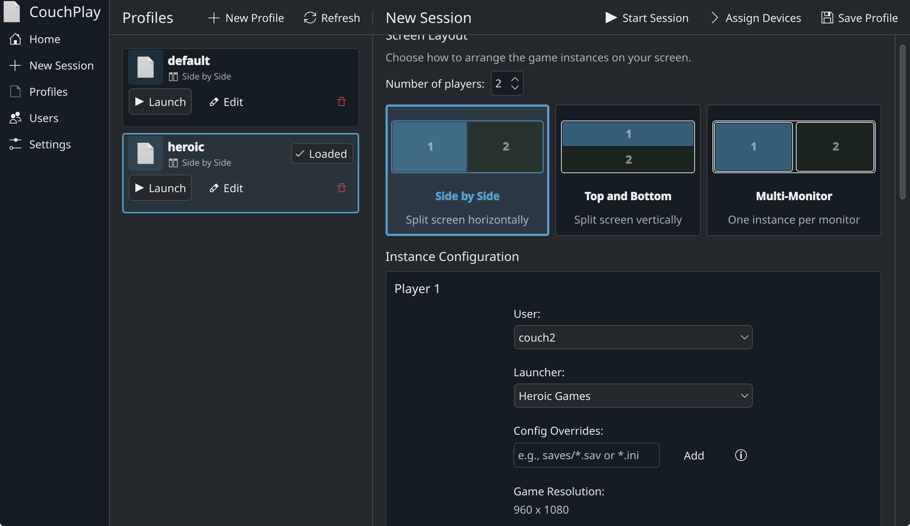

<p align="center">
  
</p>

<h1 align="center">CouchPlay</h1>

<p align="center">Split-screen gaming manager for Linux, designed for KDE Plasma and Gamescope. CouchPlay enables multi-seat gaming sessions on a single PC by managing input device assignment, multiple Gamescope instances, and audio routing.</p>

## Screenshots

<p align="center">
  
</p>

<p align="center">
  
</p>

## Features

- 🎮 **Input Isolation**: Assign specific gamepads/keyboards to specific player instances.
- 🖥️ **Multi-Instance**: Run multiple games simultaneously using Gamescope nested compositors.
- 🔊 **Audio Routing**: Route game audio to specific outputs (via PipeWire).
- 👤 **User Management**: Automatically manages temporary user accounts for isolated save data.
- 🐧 **Atomic-Ready**: Designed for immutable distributions like Bazzite and Fedora Silverblue.

## Quick Install (Linux x86_64)

Install the latest release with a single command:

```bash
curl -fsSL https://raw.githubusercontent.com/hikaps/couchplay/main/scripts/install.sh | bash
```

> **Requirements**: Linux x86_64, root privileges (sudo). This downloads and installs the latest release from GitHub, including the privileged helper service.

## Installation (Bazzite / Fedora Atomic)

CouchPlay uses a privileged helper to manage devices and users.

1. **Download** the latest release tarball from the [Releases page](../../releases).
2. **Extract** the archive:
   ```bash
   tar -xJf couchplay-x86_64.tar.xz
   cd couchplay-x86_64
   ```
3. **Install** the helper service (requires sudo):
   ```bash
   sudo ./install-helper.sh install
   ```
4. **Run** the application:
   ```bash
   ./bin/couchplay
   ```

### Uninstallation
```bash
sudo ./install-helper.sh uninstall
```

## Flatpak Installation

1. **Download** the `.flatpak` bundle from the [Releases page](../../releases).
2. **Ensure the runtime is available** (Flathub provides org.kde.Platform 6.10):
   ```bash
   flatpak install flathub org.kde.Platform/x86_64/6.10
   ```
3. **Install** the Flatpak:
   ```bash
   flatpak install --user couchplay.flatpak
   ```
4. **Install the helper service** (required for device management):
   ```bash
   flatpak run --command=bash io.github.hikaps.couchplay -c "/app/share/couchplay/install-helper.sh export"
   sudo ~/.local/share/couchplay/install-helper.sh install
   ```

> **Note**: The tarball installation method above is also available if you prefer it or your distribution doesn't support Flatpak.

## Development

### Prerequisites
- CMake 3.20+
- Qt 6.5+
- KDE Frameworks 6 (Kirigami, I18n, Config, CoreAddons)
- Gamescope
- PipeWire (devel headers)
- Polkit (devel headers)

### Building
```bash
cmake -B build
cmake --build build
```

### Running Tests
```bash
ctest --test-dir build --output-on-failure
```

## AI Disclosure

This project was developed with assistance from AI tools for code generation, documentation, and debugging.

## License
GPL-3.0-or-later
