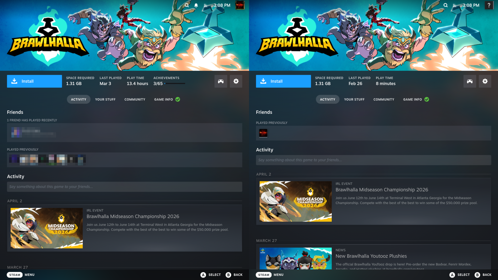

<p align="center">
  
</p>

<h1 align="center">CouchPlay</h1>

<p align="center">Split-screen gaming manager for Linux, designed for KDE Plasma and Gamescope. CouchPlay enables multi-seat gaming sessions on a single PC by managing input device assignment, multiple Gamescope instances, and audio routing.</p>

## Screenshots

<p align="center">
  
</p>

<p align="center">
  
</p>

<p align="center">
  
</p>

## Usage

### Creating a Session

1. Open the **New Session** page from the sidebar.
2. Choose a screen layout that fits your setup:
   - **Side by Side** — splits the screen horizontally
   - **Top and Bottom** — splits the screen vertically
   - **Multi-Monitor** — dedicates one display per player
3. Configure each player instance: pick a launcher (Steam, Steam Big Picture, or Heroic), then set resolution, refresh rate, and scaling options.
4. Click **Start Session** to launch all instances through Gamescope.

### Assigning Controllers

Connect your gamepads, then use the **Auto-Assign Controllers** button to let CouchPlay distribute them across player instances. You can also drag and drop devices for manual assignment. Each controller gets locked to its assigned instance so inputs don't leak between players.

### Profiles

Save a session configuration as a profile to reload it later without reconfiguring everything. Profiles are stored as JSON files in `~/.local/share/couchplay/profiles/` and can be loaded from the session page.

### Managing Users

CouchPlay creates temporary Linux user accounts so each player gets isolated save data and settings. Open the **Users** page to view and manage these accounts. The helper service handles the privileged operations behind the scenes.

## Features

- 🎮 **Input Isolation**: Assign specific gamepads/keyboards to specific player instances.
- 🖥️ **Multi-Instance**: Run multiple games simultaneously using Gamescope nested compositors.
- 🔊 **Audio Routing**: Route game audio to specific outputs (via PipeWire).
- 👤 **User Management**: Automatically manages temporary user accounts for isolated save data.
- 🐧 **Atomic-Ready**: Designed for immutable distributions like Bazzite and Fedora Silverblue.

## Installation (Linux x86_64)

Download an exact release or source commit, verify it, and inspect the installer before granting root access. Do not pipe a mutable remote script into a shell.

```bash
git checkout <reviewed-commit>
cmake -B build -DCMAKE_BUILD_TYPE=Release
cmake --build build
ctest --test-dir build --output-on-failure
```

Install only the locally verified build artifacts and helper configuration after reviewing the exact commit.

## Installation (Bazzite / Fedora Atomic)

CouchPlay uses a privileged helper to manage devices and users.

1. **Download** the latest release tarball from the [Releases page](../../releases).
2. **Extract** the archive:
   ```bash
   tar -xJf couchplay-x86_64.tar.xz
   cd couchplay-x86_64
   ```
3. **Install** the helper service (requires sudo):
   ```bash
   sudo ./install-helper.sh install
   ```
4. **Run** the application:
   ```bash
   ./bin/couchplay
   ```

### Uninstallation
```bash
sudo ./install-helper.sh uninstall
```

## Flatpak Installation

1. **Download** the `.flatpak` bundle from the [Releases page](../../releases).
2. **Ensure the runtime is available** (Flathub provides org.kde.Platform 6.10):
   ```bash
   flatpak install flathub org.kde.Platform/x86_64/6.10
   ```
3. **Install** the Flatpak:
   ```bash
   flatpak install --user couchplay.flatpak
   ```
4. **Install the helper service** (required for device management):
   ```bash
   flatpak run --command=bash io.github.hikaps.couchplay -c "/app/share/couchplay/install-helper.sh export"
   sudo ~/.local/share/couchplay/install-helper.sh install
   ```

> **Note**: The tarball installation method above is also available if you prefer it or your distribution doesn't support Flatpak.

## Development

### Prerequisites
- CMake 3.20+
- Qt 6.5+
- KDE Frameworks 6 (Kirigami, I18n, Config, CoreAddons)
- Gamescope
- PipeWire (devel headers)
- Polkit (devel headers)

### Building
```bash
cmake -B build
cmake --build build
```

### Running Tests
```bash
ctest --test-dir build --output-on-failure
```

## AI Disclosure

This project was developed with assistance from AI tools for code generation, documentation, and debugging.

## License
GPL-3.0-or-later
